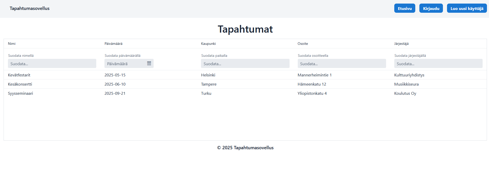

# Vaadin tapahtumat



Vaadin tapahtumat on java-web projekti, joka on toteutettu Vaadin kehitysympäristöllä tapahtumien seurantaan. Käyttäjät pystyvät lisäämään, muokkaamaan ja poistamaan tapahtumia.

## Teknologiat
- Java
- Spring boot
- Vaadin Framework
- Spring Security
- h2 tietokanta
- Maven

## Ominaisuudet
- Käyttäjähallinta ja käyttötasot (käyttäjä/admin)
- Tapahtumien hallinta (Lisäys, muokkaus ja poisto)
- Kirjautuminen ja rekisteröinti
  
## Asennus ja käyttöönotto
Varmista, että sinulla on asennettuna Java JDK 17 tai uudempi ja Maven

1. Kloonaa repo koneellesi <br>
   ```
   git clone https://github.com/Xemil85/vaadin-tapahtumat.git
   cd vaadin-tapahtumat
   ```
2. Käynnistä sovellus joko painamalla Run Java painiketta VScode tai intellij. Voit käynnistää myös sovelluksen komentoa käyttäen:
   ```
   mvnw spring-boot:run
   ```
3. Kun sovellus on käynnissä niin mene osoite http://localhost:8080/
4. Kirjaudu käyttäjällä, jotta saat kaikki ominaisuudet käyttöön:
   - Käyttäjä: käyttäjätunnus: `user`, salasana: `user`
   - Admin: käyttäjätunnus: `admin`, salasana: `admin`
